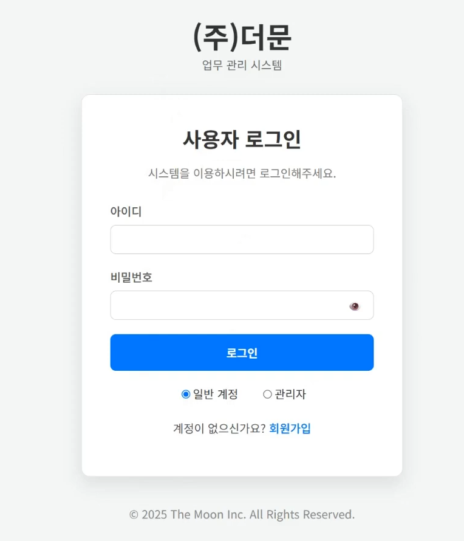
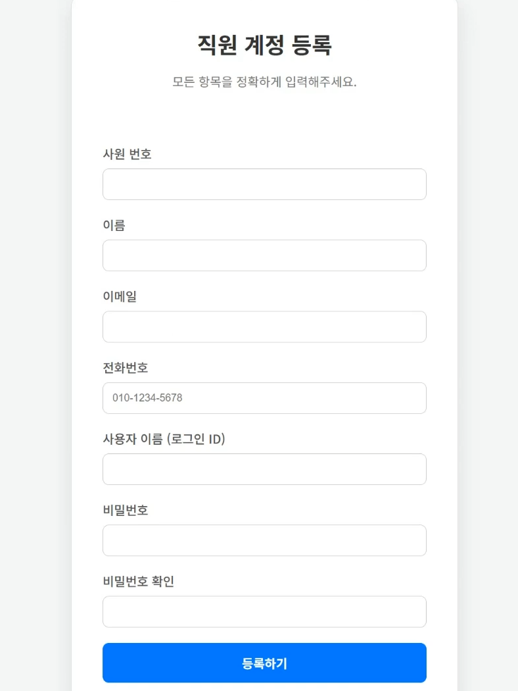
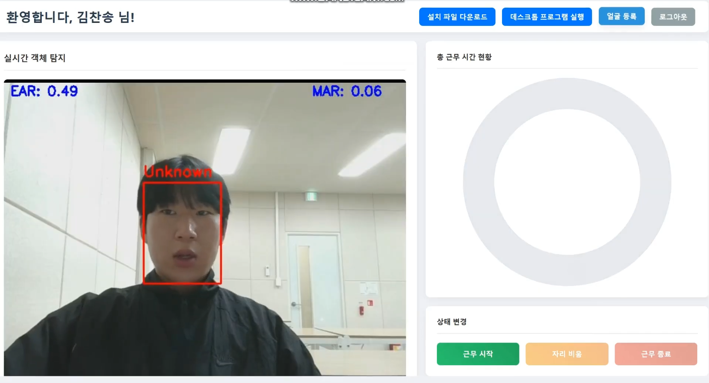
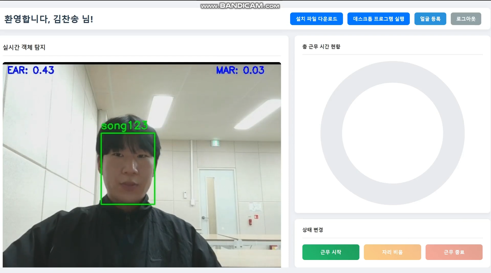
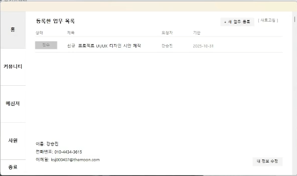
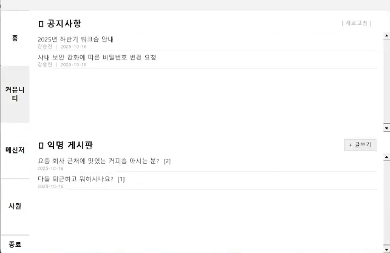
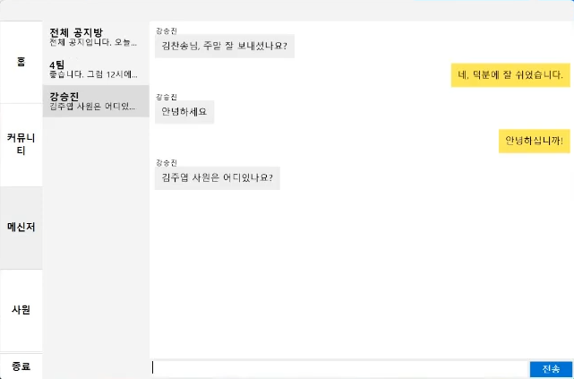
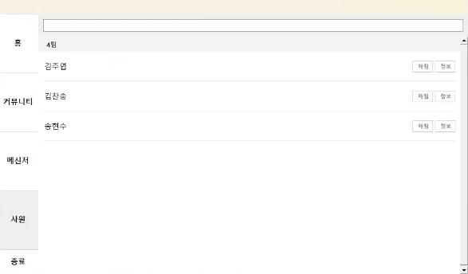

# TheMoon - 사내 메신저 및 원격 근무 관리 시스템

> **MFC와 GDI+를 활용하여 구축한 고성능 Windows 데스크톱 메신저 및 협업 플랫폼** > Flask 기반의 REST API 서버와 연동하여 실시간 소통 및 업무 관리를 지원합니다.
---
##  프로젝트 개요
**TheMoon**은 기업 내 원활한 커뮤니케이션과 원격 근무 관리를 위해 개발된 통합 솔루션입니다.  
기존 MFC 컨트롤의 UI적 한계를 극복하기 위해 **GDI+ Owner Draw** 기술을 전면 도입하여 사용자 친화적인 UI/UX를 구현했습니다. 또한, 안정적인 데이터 동기화를 위해 **REST API 기반의 비동기 폴링(Polling)** 아키텍처를 채택했습니다.

##  기술 스택 (Tech Stack)

| 구분 | 기술 스택 |
| :--- | :--- |
| **Client** | Visual C++, MFC, GDI+, C++ REST SDK (cpprest) |
| **Server** | Python (Flask), Socket.IO |
| **Database** | MySQL |
| **Web Admin** | HTML5, CSS3, JavaScript, Socket.IO Client |
| **Tools** | Visual Studio 2019, Git |

---

## 주요 기능 및 담당 역할 (Key Features)

### 1. 사내 메신저 (Corporate Messenger)
* **비동기 데이터 통신:** 소켓 연결의 복잡성을 줄이고 방화벽 이슈를 최소화하기 위해 `SetTimer`와 `C++ REST SDK`를 활용한 **2초 단위 HTTP Polling** 구조 설계. 서버 부하를 줄이면서 실시간성에 준하는 메시지 동기화 구현.
* **GDI+ 커스텀 UI:** MFC 기본 컨트롤(`CListCtrl`)을 배제하고 **GDI+**를 사용하여 말풍선(Bubble) UI, 프로필 이미지 마스킹 등을 직접 드로잉(Owner Draw)하여 직관적 UX 제공.
* **웹-앱 연동 (SSO):** Custom URI Scheme(`themoon-mfc://`)을 레지스트리에 등록하고 **JWT 토큰**을 파싱하여, 웹 대시보드에서 별도 로그인 없이 메신저를 즉시 실행하는 연동 기능 구현.

### 2. 사원 목록 및 조직도 (Contact List)
* **계층형 부서 리스트:** `std::map` 자료구조를 활용해 부서별로 사원을 그룹화하고, **GDI+**로 헤더와 리스트를 렌더링.
* **DB 트랜잭션 기반 채팅 연결:** 1:1 채팅 시 `BeginTrans` ~ `CommitTrans`를 사용하여 채팅방 생성 및 참여자 초대를 원자적(Atomic)으로 처리, 데이터 무결성 보장.
* **실시간 검색:** 검색어 입력 시 깜빡임 없이 즉각적으로 필터링되는 인메모리 검색 알고리즘 적용. 커스텀 스크롤바(`SCROLLINFO`) 로직 직접 구현.

### 3. 커뮤니티 게시판 (Community Board)
* **RESTful API 연동:** `GET`, `POST` 메서드를 통한 게시글 CRUD 구현. JSON 데이터 파싱 및 **UTF-8 인코딩** 처리를 통해 한글 호환성 확보.
* **Flicker-Free UI:** 리스트 갱신 시 발생하는 화면 깜빡임을 제거하기 위해 메모리 DC를 활용한 **더블 버퍼링(Double Buffering)** 기법 적용.

---

## 기술적 도전과 해결 (Technical Challenges)

### Q1. 소켓(Socket) 대신 폴링(Polling)을 선택한 이유는?
> **Challenge:** 초기에는 소켓 통신을 고려했으나, 사내망 방화벽 문제와 연결 유지(Keep-alive)에 따른 서버 리소스 비용이 우려되었습니다.  
> **Solution:** 텍스트 위주의 메신저 특성상 1~2초의 딜레이는 치명적이지 않다고 판단했습니다. 이에 **REST API 기반의 Short Polling** 방식을 채택하여 시스템 복잡도를 낮추고 유지보수 용이성을 확보했습니다. 클라이언트에서는 `task` 기반 비동기 처리를 통해 UI Freezing을 방지했습니다.

### Q2. MFC의 투박한 UI를 어떻게 개선했는가?
> **Challenge:** MFC의 기본 컨트롤은 스타일링에 제약이 많아 현대적인 메신저 UI를 구현하기 어려웠습니다.  
> **Solution:** `OnPaint` 메시지 핸들러에서 **GDI+** 라이브러리를 사용해 모든 UI 요소(버튼, 리스트, 스크롤바)를 직접 그렸습니다. 텍스트에는 `Anti-aliasing`을 적용해 가독성을 높였고, **더블 버퍼링**을 통해 렌더링 성능을 최적화했습니다.

### Q3. 배포 시 사용자 편의성은?
> **Challenge:** 웹 기반 관리자 페이지에서 데스크톱 앱을 실행해야 하는 요구사항이 있었습니다.  
> **Solution:** 설치 파일 제작 시 레지스트리에 **Custom URI Scheme**을 등록하도록 하여
##  시스템 흐름도 (Architecture)

### 1. 하드웨어 흐름도

> [!NOTE]
> 
> 
> 

### 2. 소프트웨어 흐름도

> [!NOTE]
> 
> 

### 3. 전체 시스템 흐름도

> [!NOTE]
> 
> 

---

## 📸 스크린샷 (Screenshots)

> [!NOTE]
> 

* **로그인 페이지**
    
* **회원가입 페이지**
    
* **메인 페이지**
    
* **얼굴 등록 페이지**
    
* **얼굴인식 페이지**
    
* **업무처리 페이지**
    
* **커뮤니티 페이지**
    
* **메세지 페이지**
    
* **사원창 페이지**
    
* **졸음감지 기능**
    

---
## 🎥 시연 영상 (Demo Video)

> 아래 이미지를 클릭하면 프로젝트 시연 영상을 유튜브에서 확인할 수 있습니다.

